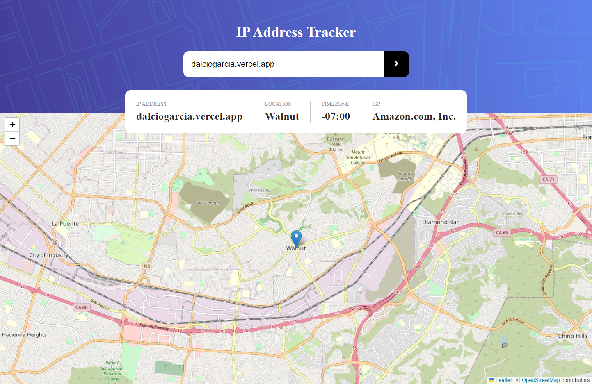
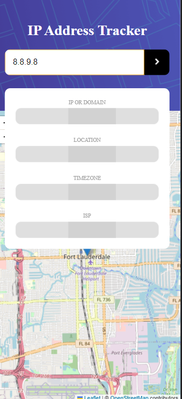
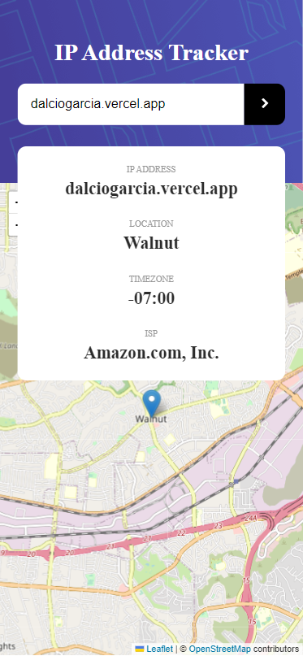

# IP address tracker solution

This is a solution to the [IP address tracker challenge on Frontend Mentor](https://www.frontendmentor.io/challenges/ip-address-tracker-I8-0yYAH0). Frontend Mentor challenges help you improve your coding skills by building realistic projects.

## Table of contents

- [Overview](#overview)
  - [The challenge](#the-challenge)
  - [Screenshot](#screenshot)
  - [Links](#links)
- [My process](#my-process)
  - [Built with](#built-with)
  - [What I learned](#what-i-learned)
  - [Continued development](#continued-development)
  - [Useful resources](#useful-resources)
- [Author](#author)

## Overview

### The challenge

Users should be able to:

- View the optimal layout for each page depending on their device's screen size
- See hover states for all interactive elements on the page
- See their own IP address on the map on the initial page load
- Search for any IP addresses or domains and see the key information and location

### Screenshot

|  |  |
| --------------------------------- | ---------------------------------- |

### Link

- Github repository: [track.this-ip-address](https://github.com/Dalcio/track-this-ip-address)
- Live Site URL: [track-this-ip-address](track-this-ip-address.vercel.app)

## My process

### Built with

- Semantic HTML5 markup
- CSS custom properties
- Flexbox
- CSS Grid
- Mobile-first workflow
- [React](https://reactjs.org/) - JS library
- [Next.js](https://nextjs.org/) - React framework
- [Stiches React](https://stitches.dev/) - For styles
- [Leaflet ](https://leafletjs.com/) - JavaScript library for interactive maps
- [React Leaflet ](https://react-leaflet.js.org/) - React components for Leaflet maps

### What I learned

- I learn **Dynamic Imports** with next js. That helped me module asynchronously and dynamically into a potentially non-module environment

### Continued development

- I pretend to continue with this project adding support for emails to.

### Useful resources

- [Create an Asset Tracker with Next.js and React Leaflet](https://dev.to/paigen11/create-an-asset-tracker-map-with-nextjs-and-react-leaflet-42d2) - This helped me setting React Leaflet with next js.

## Author

- Website - [Dálcio Garcia](https://dalciogarcia.vercel.app)
- Linkedin - [dalcio-garcia](https://linkedin.com/in/dalcio-garcia)
- Github - [@dalci](https://github.com/dalcio)
